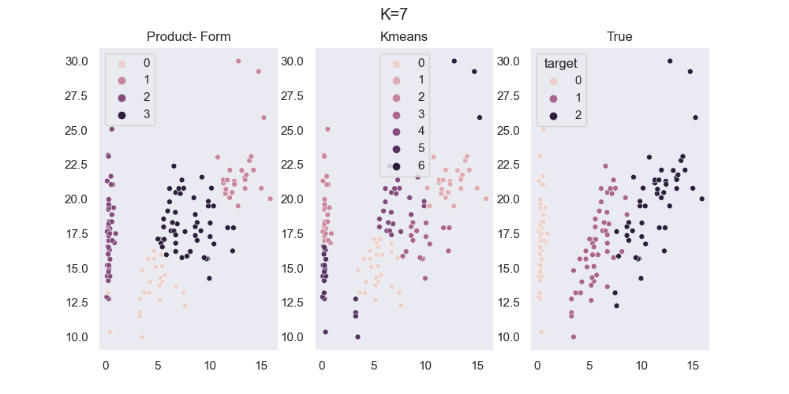

# bayesian_clustering
###  This project contains a package with two methods of bayesian clustering based on projection theory.
The product-form method (ProdForm) which assumes the priors on the partitions are in product form and, the cardinality-based (CardBased) which assumes the prior on the partitions varies based on the cardinality-array describing each partition.

## Theory
The developed theory can be found in version .py of the [Theory notebook](notebooks/all_notebooks/Theory-kBC.py)

## Description
Bayesian Clustering is a technique using Bayesian statistics to cluster data based on its distribution.
It is assumed that the clusters are normally distributed with "true" and unknown means. The target of this method is to best partition the data into clusters.
The method does *NOT* assume a fixed number of cluster (n_clusters) but an upper bound of the n_clusters, namely, "k".

## Visuals
ProdForm picks number of clusters to be 4, initialized with upper bound 7 against KMeans with predetermined number of clusters equal to 7.

## Installation
What should be written here?

## Usage
To see the project in action, check out the .py version of the [example notebook](notebooks/example-iris.py)

**It covers:**
- Application of ProdForm to 2-d data.
- Comparison between ProdForm method with KMeans and DBScan.
- Method behaviour based on different initializations.

## Authors and acknowledgment

**Elisavet Karanikola**

Master's student, [Mathematics](https://vu.nl/en/about-vu/faculties/faculty-of-science/departments/mathematics)

elizkaranikola@gmail.com

## License
[MIT License](https://opensource.org/license/mit)

## Credits
This repository was developed during my internship at [**KPMG**](https://kpmg.com/nl/nl/home.html), as part of my Master's Thesis titled "Bayesian Clustering" submitted to [**Vrije Universiteit Amsterdam**](https://vu.nl/en) in [May 2025].

## Project status
#### Ongoing ...
