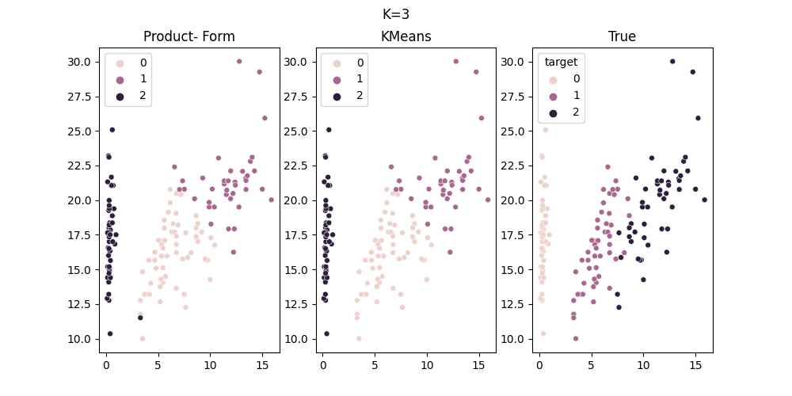
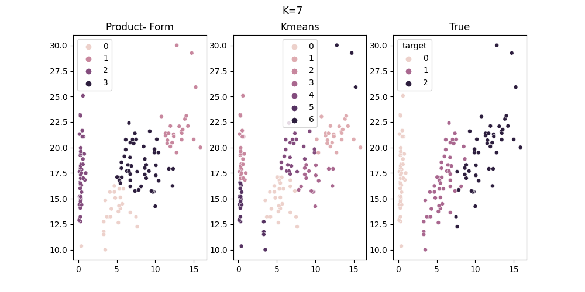
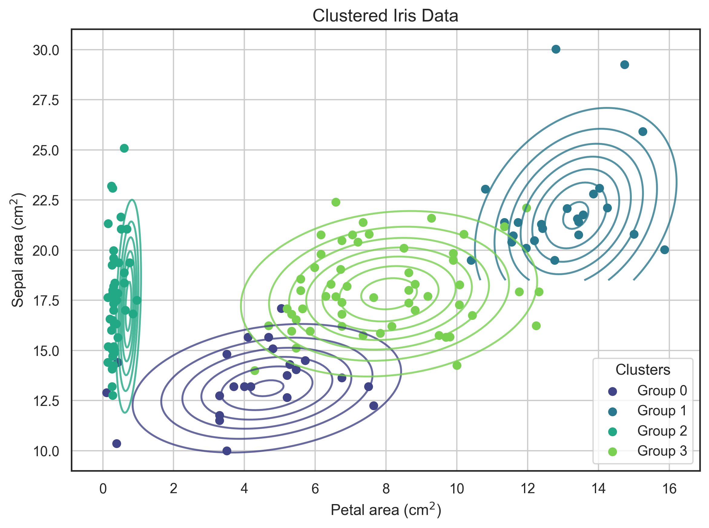

# bayesiancl

[](https://opensource.org/licenses/MIT)
[](https://www.python.org/)
[](#project-status)

A Python package implementing two methods of Bayesian clustering based on projection theory:
* **ProdForm**: Assumes the priors on the partitions are in product form.
* **CardBased**: Assumes the prior on the partitions varies based on the cardinality-array of the respective partition.

---

## Description

Bayesian Clustering uses Bayesian Inference to partition data based on its distribution. It is assumed that the clusters are normally distributed with unknown "true" means.

* **Objective**: Find the optimal partition of the data into clusters.
* **Number of Clusters**: The number of clusters is **not** assumed to be fixed; instead, an upper bound $k$ is given as input to the algorithm.

---

## Features

This project includes:
1. Mathematical theory derived from Bayesian Inference.
2. Implementations of the **ProdForm** and **CardBased** algorithms.
3. Performance evaluation distance metrics.
4. Simulated datasets and results.
5. Application on the Iris dataset.

> [!NOTE]
> The detailed theoretical background is addressed in the [Thesis Document](docs/Bayesian_Clustering_MSc.pdf).

---

## Installation

Ensure you have [Git](https://git-scm.com/) installed on your machine.

### 1. Clone the repository
```bash
git clone https://github.com/Australeza/bayesiancl.git
cd bayesiancl
```

### 2. Install the package
For regular installation:
```bash
pip install .
```

Or in development mode (if you plan to modify the code):
```bash
pip install -e .
```

### 3. (Optional) Install development dependencies
```bash
pip install -r requirements_dev.txt
```

---

## Usage

To see the package in action, check out the Python implementation in this simple [example script](notebooks/example-iris.py).

---

## Visuals

Below is the implementation of **ProdForm** on the Iris dataset (where the priors are assumed to be the K-Means centers).

### Clustering Comparison

| Initialized with Upper Bound $k = 3$ | Initialized with Upper Bound $k = 7$ |
| :---: | :---: |
|  |  |
| *Resulting partition vs. K-Means ($k=3$)* | *Resulting partition vs. K-Means ($k=7$)* |

### Recovering Normal Distributions
  
*Recovering the normal distribution of the clusters.*

---

## Authors and Acknowledgment

**Elisavet Karanikola**  
Master's student, [Applied Mathematics](https://vu.nl/en/about-vu/faculties/faculty-of-science/departments/mathematics)  
Email: [elizkaranikola@gmail.com](mailto:elizkaranikola@gmail.com)

---

## Credits

This repository was developed during my internship at [**KPMG**](https://kpmg.com/nl/nl/home.html), as part of my Master's Thesis titled *"Bayesian Clustering"* submitted to [**Vrije Universiteit Amsterdam**](https://vu.nl/en) in May 2025.

---

## License

This project is licensed under the [MIT License](https://opensource.org/license/mit).

---

## Project Status

Ongoing.


